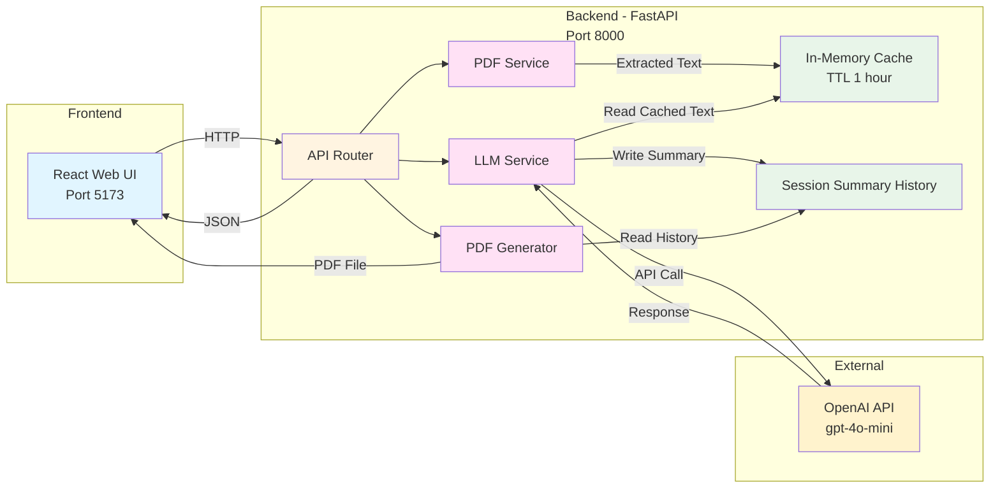

# 📊 FinSights - Financial Document Summarization AI Blueprint

AI-powered financial document analysis with intelligent section-based summarization using OpenAI's GPT models.

---

## 📋 Table of Contents

- [Overview](#overview)
  - [Key Features](#key-features)
  - [Architecture](#architecture)
- [Get Started](#get-started)
  - [Prerequisites](#prerequisites)
  - [Quick Start](#quick-start)
- [Usage Guide](#usage-guide)
- [Environment Variables](#environment-variables)
- [Documentation](#documentation)
- [Troubleshooting](#troubleshooting)
- [Contributing](#contributing)
- [License](#license)

---

## Overview

**FinSights** is an intelligent financial document analysis platform that leverages AI to automatically process and summarize financial documents. It extracts and organizes financial insights into six specialized sections, helping investors, analysts, and financial professionals quickly understand key information from lengthy financial reports, earnings statements, and other documents.

### Key Features

- 🤖 **AI-Powered Analysis**: Uses OpenAI's GPT-4o-mini for intelligent summarization
- 📄 **Multi-Format Support**: Processes text, PDF, and DOCX files with OCR for image-based PDFs
- 📊 **Structured Financial Sections**: Automatically organizes summaries into:
  - Financial Performance (narrative + numbers)
  - Key Metrics (KPIs)
  - Risks & Challenges
  - Opportunities
  - Outlook / Guidance
  - Other Important Highlights
- ⚡ **Smart Caching**: Document caching system (1-hour TTL) for instant section switching
- 💾 **Large Document Support**: Handles PDFs up to 100 pages, 50MB file size
- 🎯 **Context-Aware Analysis**: Section detection based on content semantics, not just keywords
- 📱 **Responsive UI**: Modern, mobile-friendly React + Tailwind CSS interface
- 📥 **PDF Export**: Download summaries as formatted PDF documents
- 🔒 **Production-Ready**: CORS support, comprehensive error handling, health checks

---

## Project Overview

**FinSights** is an intelligent financial document analysis platform that processes text and financial documents (PDF, DOCX) to generate comprehensive summaries organized into six key financial sections:
- **Financial Performance** - Narrative overview with key financial numbers
- **Key Metrics** - Essential KPIs and financial indicators
- **Risks** - Identified risks and challenges
- **Opportunities** - Growth and business opportunities
- **Outlook / Guidance** - Forward-looking statements and guidance
- **Other Important Highlights** - Notable items, dividends, balance sheet items, and auditor notes

Users can paste text directly or upload documents, and the system intelligently extracts and summarizes content using OpenAI's GPT-4o-mini model. The backend caches extracted documents, allowing users to explore different sections without re-uploading.

---

## Features

**Backend**

- Multiple input format support (text, PDF, DOCX)
- PDF text extraction with OCR support for image-based PDFs using pytesseract
- DOCX document processing with python-docx
- AI-powered summarization using OpenAI's GPT-4o-mini model
- Intelligent section-based summarization with context-aware analysis
- Smart document caching system (1-hour TTL, up to 25 documents) to avoid reprocessing
- File validation and size limits (PDF/DOCX: 50 MB)
- Page limit protection (max 100 pages per PDF) to prevent timeouts
- Streaming response support for optimal performance
- CORS enabled for web integration
- Comprehensive error handling and logging
- Health check endpoints
- Modular architecture (routes + services + LLM service + PDF service)

**Frontend**

- Clean, intuitive interface with tab-based input selection (Text / File)
- Drag-and-drop file upload capability
- Real-time summary display with clickable financial section chips
- Chat-like history view of all summaries
- PDF export functionality for generated summaries
- Mobile-responsive design with Tailwind CSS
- Built with Vite for fast development and hot module replacement

---

## Architecture

The application follows a modular microservices architecture with specialized components for document processing and AI summarization:



### Service Components

1. **React Web UI (Port 5173)** - Modern frontend interface
   - Tab-based input (Text / File)
   - Clickable section chips for financial insights
   - PDF export functionality
   - Chat-like history view
   - Real-time streaming responses

2. **FastAPI Backend (Port 8000)** - Orchestration and processing
   - Handles file uploads and validation
   - Routes requests to appropriate services
   - Manages document caching
   - Provides REST API with Swagger documentation
   - Health check and monitoring endpoints

3. **LLM Service** - AI-powered summarization
   - Calls OpenAI's GPT-4o-mini API
   - Intelligent section extraction
   - Context-aware analysis
   - Temperature-controlled output (default 0.2 for consistency)

4. **PDF Service** - Document processing
   - PDF text extraction using pypdf
   - DOCX processing with python-docx
   - OCR support for image-based PDFs using pytesseract
   - Page limit protection (max 100 pages)
   - Safe text cleaning

5. **In-Memory Cache** - Document caching
   - Stores extracted document text
   - 1-hour TTL (configurable)
   - Up to 25 documents (configurable)
   - Instant section switching without re-extraction

### Typical Flow

1. User inputs text or uploads a document (PDF/DOCX) through the web UI
2. Backend validates file and size
3. For PDF/DOCX: PDF Service extracts text with OCR support
4. For text: Used directly
5. Extracted text sent to LLM Service
6. LLM Service calls OpenAI's GPT-4o-mini API
7. Model generates comprehensive summary with 6 financial sections
8. Backend caches extracted content (using doc_id)
9. Summary returned to frontend with structured section data
10. User can click sections for detailed view (instant, no re-extraction)
11. User can export summary as PDF

---

## Get Started

### Prerequisites

Before you begin, ensure you have the following installed and configured:

- **Docker and Docker Compose** (v20.10+)
  - [Install Docker](https://docs.docker.com/get-docker/)
  - [Install Docker Compose](https://docs.docker.com/compose/install/)
- **OpenAI API Key** (for GPT-4o-mini access)
  - [Create OpenAI Account](https://platform.openai.com/account/api-keys)
  - [API Key Management](https://platform.openai.com/account/billing/overview)

#### Verify Installation

```bash
# Check Docker
docker --version
docker compose version

# Verify Docker is running
docker ps
```

### Quick Start

#### 1. Clone or Navigate to Repository

```bash
# If cloning:
git clone <your-repo-url>
cd FinSights
```

#### 2. Configure Environment Variables

Create `backend/.env` with your OpenAI credentials:

```bash
cat > backend/.env << EOF
# OpenAI Configuration (REQUIRED)
OPENAI_API_KEY=your_openai_api_key_here
OPENAI_MODEL=gpt-4o-mini

# LLM Configuration
LLM_TEMPERATURE=0.2
LLM_MAX_TOKENS=900

# Caching Configuration
CACHE_MAX_DOCS=25
CACHE_TTL_SECONDS=3600

# Service Configuration
SERVICE_PORT=8000
LOG_LEVEL=INFO

# CORS Settings
CORS_ORIGINS=*
EOF
```

**Replace** `your_openai_api_key_here` with your actual OpenAI API key.

#### 3. Launch the Application

**Option A: Standard Deployment**

```bash
# Build and start all services
docker compose up --build

# Or run in detached mode (background)
docker compose up -d --build
```

**Option B: View Logs While Running**

```bash
# All services
docker compose up --build

# In another terminal, view specific logs
docker compose logs -f backend
docker compose logs -f frontend
```

#### 4. Access the Application

Once containers are running, access:

- **Frontend UI**: http://localhost:5173
- **Backend API**: http://localhost:8000
- **API Documentation**: http://localhost:8000/docs
- **API Redoc**: http://localhost:8000/redoc

#### 5. Verify Services

```bash
# Check health status
curl http://localhost:8000/health

# View running containers
docker compose ps
```

#### 6. Stop the Application

```bash
docker compose down
```

---

## Usage Guide

### Using FinSights

1. **Open the Application**
   - Navigate to `http://localhost:5173`

2. **Choose Input Method**
   - **Paste Text Tab**: Copy/paste financial document text directly
   - **Upload File Tab**: Upload PDF or DOCX files (max 50MB)

3. **Generate Summary**
   - Click "Summarize" button
   - Wait for AI processing
   - View comprehensive financial summary

4. **Explore Financial Sections**
   - Click any section chip to view detailed analysis:
     - Financial Performance
     - Key Metrics
     - Risks
     - Opportunities
     - Outlook / Guidance
     - Other Important Highlights
   - Switching sections is instant (cached document)

5. **Export Results**
   - Click "Export as PDF" button
   - Save formatted summary to your computer

6. **View History**
   - All previous summaries in chat-like history
   - Scroll through past analyses
   - Re-explore or export any summary

### Performance Tips

- **Large PDFs**: For PDFs > 100 pages, only first 100 pages are processed
- **Best Results**: Clearly formatted financial documents with structured text
- **Caching**: First analysis processes document, subsequent sections are instant
- **Temperature Setting**: Default 0.2 ensures consistent, focused summaries

---

## Environment Variables

Configure the application behavior using environment variables in `backend/.env`:

| Variable | Description | Default | Type |
|----------|-------------|---------|------|
| `OPENAI_API_KEY` | OpenAI API key for GPT access (REQUIRED) | - | string |
| `OPENAI_MODEL` | GPT model version to use | `gpt-4o-mini` | string |
| `LLM_TEMPERATURE` | Model creativity level (0.0-2.0, lower = deterministic) | `0.2` | float |
| `LLM_MAX_TOKENS` | Maximum tokens per summary response | `900` | integer |
| `CACHE_MAX_DOCS` | Maximum documents in memory cache | `25` | integer |
| `CACHE_TTL_SECONDS` | Cache time-to-live in seconds | `3600` | integer |
| `SERVICE_PORT` | Backend API port | `8000` | integer |
| `LOG_LEVEL` | Logging level (DEBUG, INFO, WARNING, ERROR) | `INFO` | string |
| `CORS_ORIGINS` | Allowed CORS origins (comma-separated or `*`) | `*` | string |
| `MAX_PDF_PAGES` | Maximum PDF pages to process | `100` | integer |
| `MAX_PDF_SIZE` | Maximum PDF file size in bytes | `52428800` | integer |

### Configuration Examples

**Production Setup**
```bash
OPENAI_API_KEY=sk-your-production-key
OPENAI_MODEL=gpt-4o-mini
LLM_TEMPERATURE=0.1
LOG_LEVEL=WARNING
CACHE_MAX_DOCS=50
CORS_ORIGINS=https://yourdomain.com,https://app.yourdomain.com
```

**Development Setup**
```bash
OPENAI_API_KEY=sk-your-dev-key
OPENAI_MODEL=gpt-4o-mini
LLM_TEMPERATURE=0.5
LOG_LEVEL=DEBUG
CACHE_MAX_DOCS=10
```

---

## Documentation

For detailed information, refer to the following resources:

- **[User Guide](./docs/USER_GUIDE.md)**: Comprehensive guide on using the application
- **[API Documentation](http://localhost:8000/docs)**: Interactive Swagger API documentation (when running)
- **[Troubleshooting Guide](./TROUBLESHOOTING.md)**: Solutions for common issues
- **[Architecture Overview](./docs/ARCHITECTURE.md)**: Deep dive into system design
- **[Deployment Guide](./docs/DEPLOYMENT.md)**: Advanced deployment options

---

## Technology Stack

### Backend
- **Framework**: FastAPI (Python web framework)
- **AI/LLM**: OpenAI GPT-4o-mini API
- **Document Processing**: 
  - pypdf (PDF text extraction)
  - python-docx (DOCX processing)
  - pdf2image + pytesseract (OCR for image-based PDFs)
- **Async**: Uvicorn ASGI server
- **Config**: Python-dotenv for environment management

### Frontend
- **Framework**: React 18 with React Router
- **Build Tool**: Vite (fast bundler)
- **Styling**: Tailwind CSS + PostCSS
- **UI Components**: Lucide React icons
- **Export**: jsPDF for PDF generation
- **Notifications**: react-hot-toast

### DevOps
- **Containerization**: Docker + Docker Compose
- **Architecture**: Microservices with isolated containers
- **Networking**: Docker bridge network

---

## Troubleshooting

Encountering issues? Check the following:

### Common Issues

**Issue**: API not responding
```bash
# Check service health
curl http://localhost:8000/health

# View backend logs
docker compose logs backend
```

**Issue**: OpenAI API errors
- Verify `OPENAI_API_KEY` is correct and has credits
- Check API key permissions in OpenAI dashboard
- Ensure model `gpt-4o-mini` is available in your account

**Issue**: PDF upload fails
- Max file size: 50MB
- Max pages: 100 pages
- Supported formats: PDF, DOCX
- Ensure file is not corrupted

**Issue**: Frontend can't connect to API
- Verify backend is running: `docker compose ps`
- Check CORS settings in `.env`
- Ensure both services are on same network

### Debug Mode

Enable debug logging:

```bash
# Update .env
LOG_LEVEL=DEBUG

# Restart services
docker compose restart backend
docker compose logs -f backend
```

### Still Need Help?

1. Check [TROUBLESHOOTING.md](./TROUBLESHOOTING.md) for detailed solutions
2. Review [API Documentation](http://localhost:8000/docs) for endpoint details
3. Submit an issue on GitHub with logs and steps to reproduce

---

## Contributing

We welcome contributions! Please see our [Contributing Guide](./CONTRIBUTING.md) for details on:

- Development setup and environment configuration
- Coding standards and best practices
- Testing guidelines and examples
- Pull request process and code review guidelines

### Development Quick Start

```bash
# Install backend dependencies
cd backend
pip install -r requirements.txt

# Install frontend dependencies
cd ../frontend
npm install

# Run in development mode
# Terminal 1: Backend
cd backend
python server.py

# Terminal 2: Frontend
cd frontend
npm run dev
```

### Project Structure

```
FinSights/
├── backend/
│   ├── api/
│   │   └── routes.py          # API endpoints
│   ├── services/
│   │   ├── llm_service.py     # OpenAI integration
│   │   └── pdf_service.py     # Document processing
│   ├── server.py              # FastAPI app
│   ├── config.py              # Configuration
│   ├── requirements.txt        # Python dependencies
│   └── Dockerfile             # Backend container
├── frontend/
│   ├── src/
│   │   ├── pages/             # React pages
│   │   ├── components/        # React components
│   │   ├── services/          # API client
│   │   └── App.jsx            # Main app
│   ├── package.json           # npm dependencies
│   └── Dockerfile             # Frontend container
├── docker-compose.yml         # Service orchestration
└── README.md                  # This file
```

---

## Community

- **GitHub Issues**: [Report bugs or request features](https://github.com/your-org/finsights/issues)
- **Discussions**: [Ask questions and share ideas](https://github.com/your-org/finsights/discussions)
- **Documentation**: [Comprehensive guides and API references](./docs/README.md)

---

## References

### Related Technologies

- [OpenAI API](https://platform.openai.com/docs/api-reference) - GPT API documentation
- [FastAPI](https://fastapi.tiangolo.com/) - Modern Python web framework
- [React](https://react.dev/) - JavaScript UI library
- [Docker](https://docs.docker.com/) - Containerization platform
- [Tailwind CSS](https://tailwindcss.com/) - Utility-first CSS framework

### Similar Projects

- [NVIDIA AI Blueprints](https://github.com/NVIDIA-AI-Blueprints) - Collection of AI application templates
- [Langchain](https://www.langchain.com/) - LLM application framework
- [Llamaindex](https://www.llamaindex.ai/) - Data framework for LLM apps

### Financial AI Resources

- [OpenAI Fine-Tuning](https://platform.openai.com/docs/guides/fine-tuning) - Custom model training
- [Financial NLP Models](https://huggingface.co/models?search=financial) - Domain-specific models

---

## License

This project is licensed under the [MIT License](./LICENSE) - see LICENSE file for details.

For third-party licenses, see [LICENSE-3rd-party.txt](./LICENSE-3rd-party.txt)

---

## Disclaimer

**FinSights** is provided as-is for analysis and informational purposes. While we strive for accuracy:

- Always verify AI-generated summaries against original documents
- Do not rely solely on AI summaries for investment decisions
- Consult financial advisors for investment guidance
- Test thoroughly before using in production environments

---

## Support & Feedback

Have suggestions or encountered an issue?

- 🐛 [Report Bugs](https://github.com/your-org/finsights/issues)
- 💡 [Request Features](https://github.com/your-org/finsights/issues)
- 💬 [Start Discussions](https://github.com/your-org/finsights/discussions)
- 📧 [Contact Us](mailto:support@yourdomain.com)

---

**Made with ❤️ for financial professionals and AI enthusiasts**

[Back to Top](#-finsights---financial-document-summarization-ai-blueprint)
